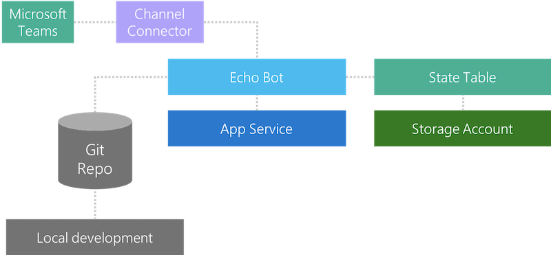

# Chatbot Development Hands-On Day

Welcome to the Chatbot Development Hands-On Day! Today, we'll go through how to build a simple "Time-Off Bot" using [Azure Bot Service](https://docs.microsoft.com/en-us/azure/bot-service/). The day is organized by different challenges and participants should complete Step 1 through 4. Step 5 contains additional ideas that can be implemented if desired.

Our final bot might look something like this:

## Challenges

### Step 1 - Setup a basic bot

As a first step, we need to lay out the foundation for our bot. This means getting a basic bot running, enable basic CI (Continuous Integration) via `git`. In order to move to the next step, you should be able to check off the following items:

* You have a Bot running on App Service (based on the `Basic` template in the Azure Portal)
* You should be able to deploy code change to your bot via local Git deployment
* You should be able to test your bot locally before pushing to Azure
* Your bot should persist its state in an Azure Table
* Users should be able to talk to your Bot via Microsoft Teams (or other channels)

Here are some resources that might help you reaching your goal quicker:
* [Deploying a basic bot on Azure Bot Service](https://docs.microsoft.com/en-us/azure/bot-service/bot-service-quickstart)
* [Azure Storage Explorer](https://azure.microsoft.com/en-us/features/storage-explorer/)
* Managing bot state data in [.NET](https://docs.microsoft.com/en-us/azure/bot-service/dotnet/bot-builder-dotnet-state) or [Node.js](https://docs.microsoft.com/en-us/azure/bot-service/nodejs/bot-builder-nodejs-state)
* Connecting bots into [channels](https://docs.microsoft.com/en-us/azure/bot-service/bot-service-manage-channels)
* [Bot Framework Emulator](https://docs.microsoft.com/en-us/azure/bot-service/bot-service-debug-emulator)

### Step 2 - Implement dialog flow

In the second step, we'll lay out the basic dialog flow of our bot. In order to move to the next step, you should be able to check off the following items:

* Have a root dialog
* Have an empty request time-off dialog
* Have an empty show time-off dialog
* Have an empty help dialog
* Be able to navigate through dialogs via static phrases ("show time-off", "request time-off")

Here are some resources that might help you reaching your goal quicker:
* Creating dialogs in [.NET](https://docs.microsoft.com/en-us/azure/bot-service/dotnet/bot-builder-dotnet-dialogs) and [Node.js](https://docs.microsoft.com/en-us/azure/bot-service/nodejs/bot-builder-nodejs-dialog-overview)
* Manage dialog flow in [.NET](https://docs.microsoft.com/en-us/azure/bot-service/dotnet/bot-builder-dotnet-manage-conversation-flow) and [Node.js](https://docs.microsoft.com/en-us/azure/bot-service/nodejs/bot-builder-nodejs-dialog-manage-conversation-flow)
* Suggested actions in [.NET](https://docs.microsoft.com/en-us/azure/bot-service/dotnet/bot-builder-dotnet-add-suggested-actions)
 and [Node.js](https://docs.microsoft.com/en-us/azure/bot-service/nodejs/bot-builder-nodejs-send-suggested-actions)

### Step 3 - Add natural language understanding

In this step, we'll make our bot understand natural language. For this, we'll leverage LUIS (Azure's Language Understanding Service). This means you have to create a custom language model and connect it to your bot. In order to move to the next step, you should be able to check off the following items:

* Have a LUIS model trained and published, that will be used to recognize the user's intent (request time-off or show existing time-off)
* Have your LUIS model integrated in your Bot
* Use the integrated LUIS model for routing between the dialogs

Here are some resources that might help you reaching your goal quicker:
* [LUIS](https://www.luis.ai) and [LUIS Europe](https://eu.luis.ai)
* Integrate LUIS models with [.NET](https://docs.microsoft.com/en-us/azure/bot-service/dotnet/bot-builder-dotnet-luis-dialogs) and [Node.js](https://docs.microsoft.com/en-us/azure/bot-service/nodejs/bot-builder-nodejs-recognize-intent-luis)

### Step 4 - Implement business logic

Lastly, we want to implement some (basic) business logic in our bot. In a real world example, our bot might integrate with existing systems for processing time-off requests. In our example here, we can use a storage destination of our choice. You can even use `userData` for persisting time-off requests, but be aware that `userData` is channel specific. In order to complete the main part of our day, you should be able to check off the following items:

* Your "request time-off" dialog should request time-off parameters like start date, end date, and vacation destination
* Your "show time-off" dialog should show existing time-off requests using Adaptive Cards
* Your help dialog should show something useful
* Your bot should proactively welcome the user

Here are some resources that might help you reaching your goal quicker:
* Resolving entities in [Node.js](https://docs.microsoft.com/en-us/azure/bot-service/nodejs/bot-builder-nodejs-dialog-prompt)
* Using FormFlow [.NET](https://docs.microsoft.com/en-us/azure/bot-service/dotnet/bot-builder-dotnet-formflow)
* Adaptive Cards in [.NET](https://docs.microsoft.com/en-us/azure/bot-service/dotnet/bot-builder-dotnet-add-rich-card-attachments) and [Node.js](https://github.com/Microsoft/BotBuilder-Samples/tree/master/Node/cards-AdaptiveCards)

### Step 5 (optional) - More ideas

Now that we have a basic bot running, we can start embedding more functionality. Here are some ideas for learning more:

* Use Visual Studio Team Services (VSTS) as your CI/CD pipeline
* Implement data persistency with Azure Table or Azure CosmosDB
* Leverage Cognitive Services to show images of the user's vacation destination in the "show time-off" dialog

## License

Licensed using the MIT License (MIT) - Copyright (c) Microsoft Corporation. For more information, please see [LICENSE](LICENSE).
