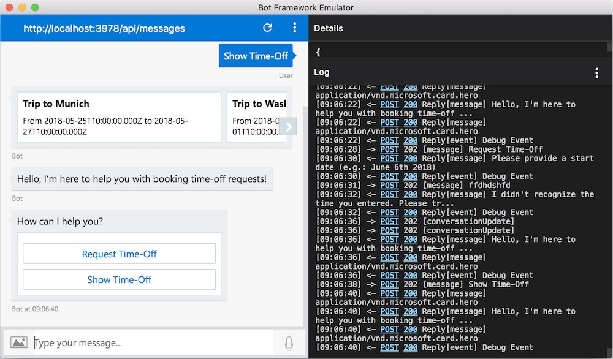

# Hints for completing Step 4

## Welcoming the user

Our `MessagesController.cs` already has a hook where we can implement functionality that is triggered once a user joins or leaves a conversation:

```csharp
...
else if (message.Type == ActivityTypes.ConversationUpdate)
{
    // Handle conversation state changes, like members being added and removed
    // Use Activity.MembersAdded and Activity.MembersRemoved and Activity.Action for info
    // Not available in all channels
    if (message.MembersAdded.Any(o => o.Id == message.Recipient.Id))
    {
        ConnectorClient connector = new ConnectorClient(new Uri(message.ServiceUrl));
        Activity reply = message.CreateReply("Hello, welcome to the Time-Off Bot!");
        connector.Conversations.ReplyToActivityAsync(reply);
    }
}
...
```

## Handling time-off requests

Handling time-off requests can either happen through LUIS by recognizing entities or by just guiding the user through a waterfall dialog and asking for the respective fields. In this example, we just use a waterfall dialog and the Bot Framework will already do the job of parsing the date reliably for us.

For sake of simplicity, we're storing the time-off requests in the user's `session.userData`. This is persisted across multiple conversations, but specific per channel. A better solution would be to persist this in a Table, SQL database, in CosmosDB or somewhere else.

```csharp
[Serializable]
public class TimeOffRequestForm
{
    [Prompt("Please enter the start date for your time-off request?")]
    public DateTime StartDate;
    [Prompt("Please enter the final date for your time-off request?")]
    public DateTime EndDate;
    [Prompt("Would you care to share where will you go?")]
    public String Destination;

    public static IForm<TimeOffRequestForm> BuildForm()
    {
        return new FormBuilder<TimeOffRequestForm>()
                .Message("Before I put in your vacation request, I need a few details:")
                .AddRemainingFields()
                .OnCompletion(PersistTimeOffRequest)
                .Confirm("Time-Off Request from {StartDate} to {EndDate} in {Destination}. Is that correct?")
                .Build();
    }

    private static async Task PersistTimeOffRequest(IDialogContext context, TimeOffRequestForm state)
    {
        List<TimeOffRequestForm> data;

        if (!context.UserData.TryGetValue<List<TimeOffRequestForm>>("timeoff", out data))
        {
            data = new List<TimeOffRequestForm>();
        }
        data.Add(state);

        context.UserData.SetValue<List<TimeOffRequestForm>>("timeoff", data);
        await context.PostAsync("I've saved your request, thank you!");

    }
};

[Serializable]
public class RequestTimeOffDialog : IDialog<object>
{
    public async Task StartAsync(IDialogContext context)
    {
        var FormDialog = new FormDialog<TimeOffRequestForm>(new TimeOffRequestForm(), TimeOffRequestForm.BuildForm, FormOptions.PromptInStart);
        context.Call(FormDialog, this.OnFormCompleted);
    }

    private async Task OnFormCompleted(IDialogContext context, IAwaitable<TimeOffRequestForm> result)
    {
        context.Done<object>(null);
    }
}
```

## Showing time-off requests

Lastly, we can use a [carousel of Hero cards](https://docs.microsoft.com/en-us/azure/bot-service/dotnet/bot-builder-dotnet-add-rich-card-attachments#add-a-hero-card-to-a-message) to nicely display the existing time-off requests for a user. This would also allow us to easily add a button for deleting existing requests.

```csharp
[Serializable]
public class ShowTimeOffDialog : IDialog<object>
{
    public async Task StartAsync(IDialogContext context)
    {
        List<TimeOffRequestForm> data;

        if (!context.UserData.TryGetValue<List<TimeOffRequestForm>>("timeoff", out data))
        {
            await context.PostAsync("You have no time-off planned!");
        }
        else
        {
            var reply = context.MakeMessage();
            reply.AttachmentLayout = AttachmentLayoutTypes.Carousel;
            reply.Attachments = new List<Attachment>();

            data.ForEach(async x => {
                HeroCard card = new HeroCard()
                {
                    Title = $"Trip to {x.Destination}",
                    Text = $"From {x.StartDate} to {x.EndDate}"
                };
                reply.Attachments.Add(card.ToAttachment());
            });
            await context.PostAsync(reply);
        }
        context.Done<object>(null);
    }
}
```

